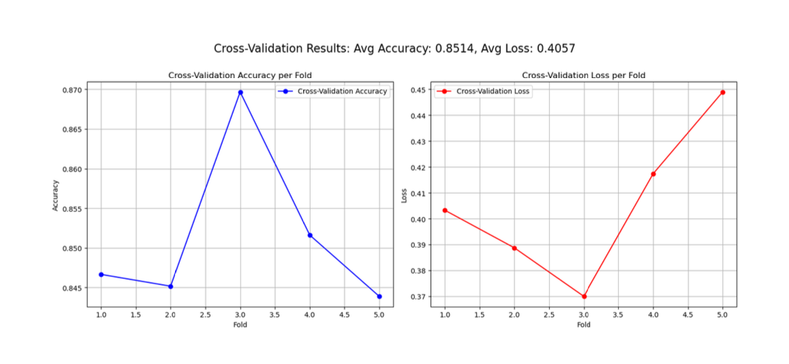
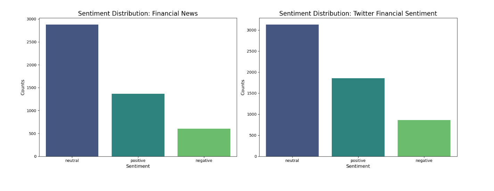
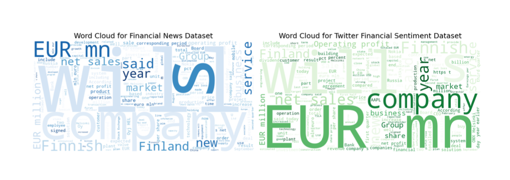
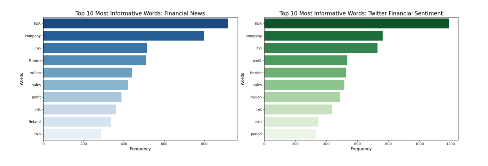

# **Financial Sentiment Analysis using DistilBERT**

## **Project Overview**

This project applies advanced Natural Language Processing (NLP) techniques to perform sentiment analysis on financial news articles and tweets. By leveraging Hugging Face's `DistilBERT` model, we classify the sentiment of text data into Negative, Neutral, and Positive categories. DistilBERT, a smaller and faster version of BERT, is fine-tuned for the financial domain, making it particularly well-suited for this task. The project emphasizes model fine-tuning, cross-validation, regularization, and visualization of performance metrics, and demonstrates how sentiment analysis can provide insights into market trends and financial decision-making.

### **Why Sentiment Analysis Matters**

Financial sentiment analysis plays a crucial role in understanding market behavior and predicting future trends. Sentiment reflected in financial news and social media can influence everything from stock prices to investment strategies. This project provides a deeper dive into analyzing the sentiment around financial events, helping investors make more informed decisions. Notably, sentiment analysis is highlighted as a key component in reports like the [J.P. Morgan Long-Term Capital Market Assumptions](https://www.jpmorgan.com/global/research/annual-long-term-capital-market-assumptions), demonstrating its importance in modern financial analysis.

## **Getting Started**

### **Prerequisites**

Make sure you have Python 3.8+ installed. Create a virtual environment, activate it, and install the required dependencies listed in `requirements.txt`:

### **Datasets**

We used two key datasets to train and evaluate our model:

1. **[Sentiment Analysis on Financial Tweets (Kaggle)](https://www.kaggle.com/datasets/vivekrathi055/sentiment-analysis-on-financial-tweets)**: This dataset contains financial-related tweets labeled with sentiment scores (positive, neutral, negative), providing a real-time sentiment analysis of financial discussions on Twitter.
   
2. **[Sentiment Analysis for Financial News (Kaggle)](https://www.kaggle.com/datasets/ankurzing/sentiment-analysis-for-financial-news)**: A dataset that categorizes financial news articles into sentiment categories, reflecting the tone of news articles published by major financial media outlets.

Both datasets are stored in the `data/` directory. Preprocessing techniques were applied to clean, tokenize, and prepare the text data for modeling.

## **Workflow**

1. **Data Preprocessing**
   - The text data is preprocessed using tokenization, lowercasing, and removing stopwords. Sentences are then tokenized into a format suitable for `DistilBERT`.
   
2. **Model Training**
   - The `DistilBERT` model is fine-tuned on the preprocessed financial datasets. This process includes cross-validation and the application of regularization techniques (dropout, weight decay) to prevent overfitting.
   
3. **Evaluation**
   - Model performance is evaluated using various metrics such as accuracy, F1-score, and ROC curves. Confusion matrices are also employed to analyze the classification errors.
   
4. **Visualization**
   - Visualizations such as word clouds, sentiment distribution bar charts, ROC curves, and confusion matrices provide a clearer understanding of the model’s performance and the distribution of financial sentiments in the data.

## **Model Training**

- **Model Architecture**: The primary model used is `DistilBERT`, a transformer-based model known for its efficiency and performance in text classification tasks. DistilBERT is pre-trained on large corpora and fine-tuned for financial sentiment analysis in this project.
- **Fine-Tuning**: We employed techniques such as early stopping, learning rate scheduling, and dropout regularization to optimize the model during training. Cross-validation was performed to ensure robustness and generalizability.
- **Performance**: The model consistently achieved an average accuracy of **85.14%** across multiple cross-validation folds, demonstrating strong performance in classifying sentiment across financial datasets.

## **Evaluation & Visualizations**

Key evaluation metrics and visualizations used to interpret model performance:

- **Accuracy & Loss Plots**: Track model performance during training and cross-validation.
  
  
  
- **Confusion Matrix**: Visualize the number of correct and incorrect predictions for each sentiment class.
  
  
  
- **ROC Curves**: Demonstrate the model’s ability to distinguish between the different sentiment categories.
  
- **Word Clouds**: Highlight the most frequent and informative words used in financial news and tweets.
  
  
  
- **Top 10 Most Informative Words**: Show the top words contributing to predictions across each sentiment class.
  
  

## **Usage**

### **Training the Model**

Run the training script to fine-tune the `DistilBERT` model using cross-validation and regularization:

The results will be saved in the `results/` directory.

## **Results**

- The model demonstrated strong generalization with an average accuracy of **85.14%**.
- **ROC Curves** and **Confusion Matrices** help visualize performance across sentiment classes.
- Word clouds offer insights into the most frequent and significant words for each sentiment category.

## **Future Improvements**

Potential improvements to enhance the project further:
- **Data Augmentation**: Increase dataset diversity by adding more labeled data from other financial sources or synthetically augmenting existing data.
- **Hyperparameter Tuning**: Experiment with different hyperparameters such as learning rate, batch size, and optimizer choices to boost performance.
- **Ensemble Learning**: Combine multiple models such as DistilBERT, LSTM, and CNN to create an ensemble model for improved accuracy and robustness.

## **License**

This project is licensed under the MIT License. See `LICENSE` for more details.

## **Acknowledgements**

- Thanks to Hugging Face for their `transformers` library, which powers the model fine-tuning.
- Datasets are courtesy of contributors on Kaggle, including Vivek Rathi and Ankur Zing.
- Special thanks to Matplotlib and scikit-learn for providing visualization and evaluation tools.
